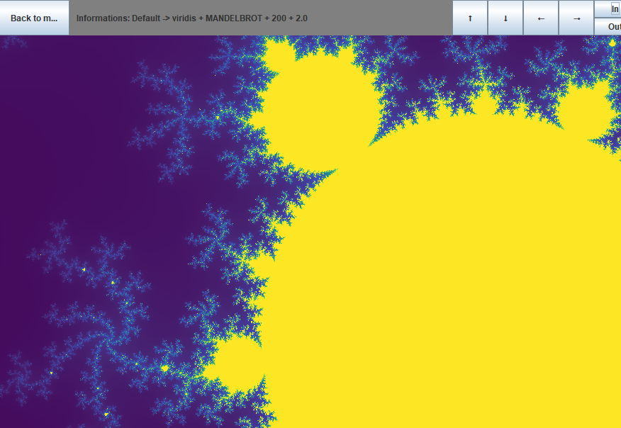

# Fractal viewer

## Table of Contents
1. [Project Description](#project-description)
2. [Screenshots](#screenshots)
3. [Technologies Used](#technologies-used)
4. [Installation](#installation)
5. [How to Run](#how-to-run)
6. [Running Tests](#running-tests)
7. [Generating Documentation](#generating-documentation)
8. [UML](#uml)

## Project Description
This is a fractal-viewer application in which you can view a few fractals like: mandelbrot, julia.

In the program you can customize attributes about the calculation of the fractal, and the rendering.

After that you can move around in the viewer and zoom in and out of the fractal.

## Screenshots
Here are some examples of fractals generated with the viewer:




## Technologies Used
- Java 22
- Maven 3.8.7
- JUnit 5

## Installation
Make sure you have maven installed

Clone this repository:
```bash
git clone https://github.com/Gyari03/Prog3_NHF.git
```

## How to run

Compile the project:
```bash
mvn clean compile
```


Run the main application:
```bash
mvn exec:java
```

## Running tests
```bash
mvn test
```

## Generating Documentation
Project has javadoc plugin.
You can generate javadoc with this command:
```bash
mvn javadoc:javadoc
```
After this it will be generated inside
```bash
target/reports/apidocs/index.html
```